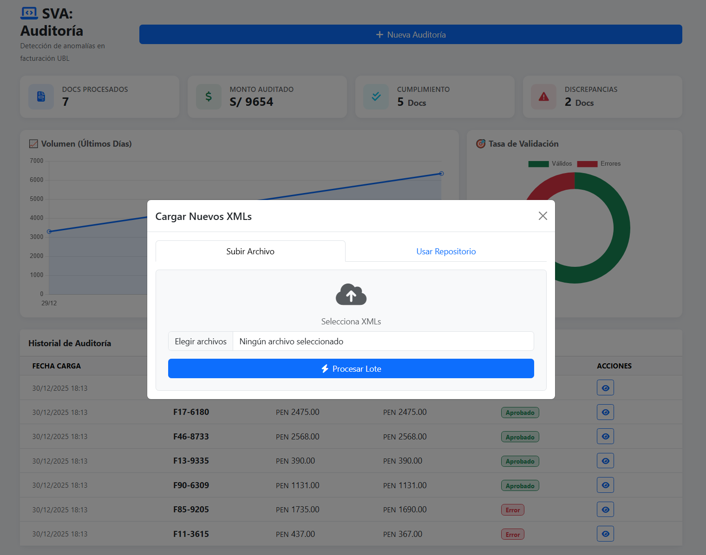
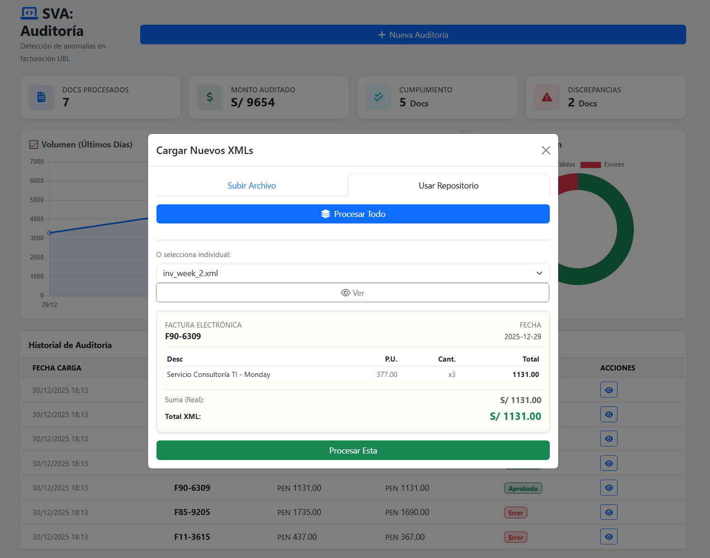
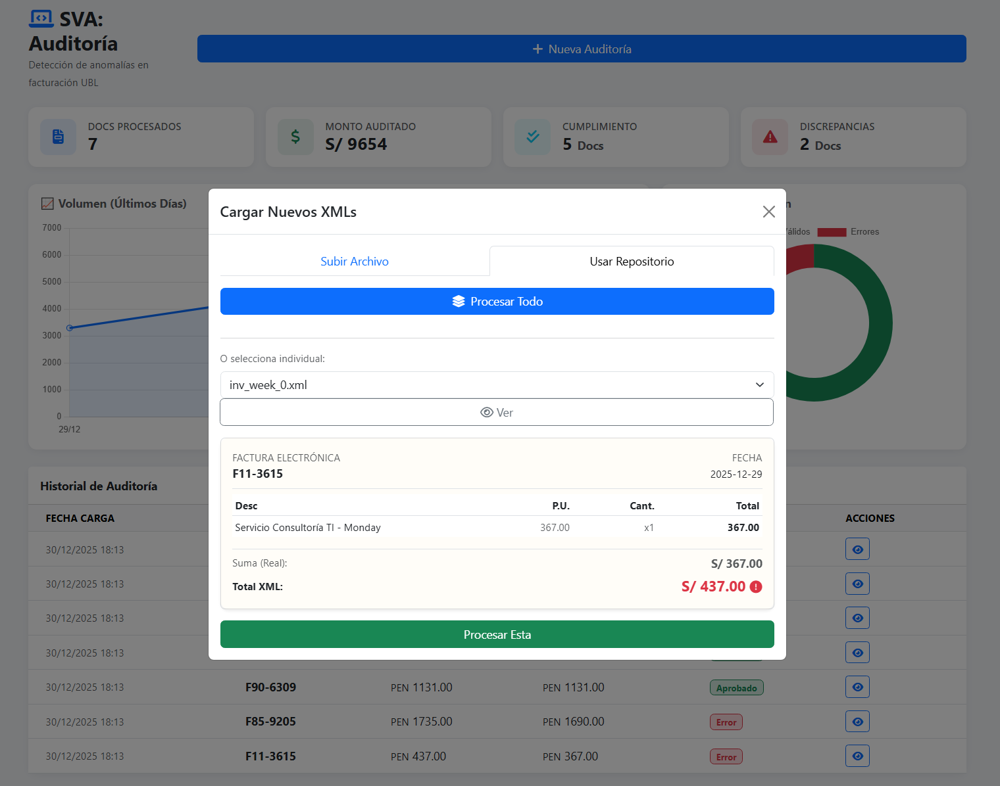
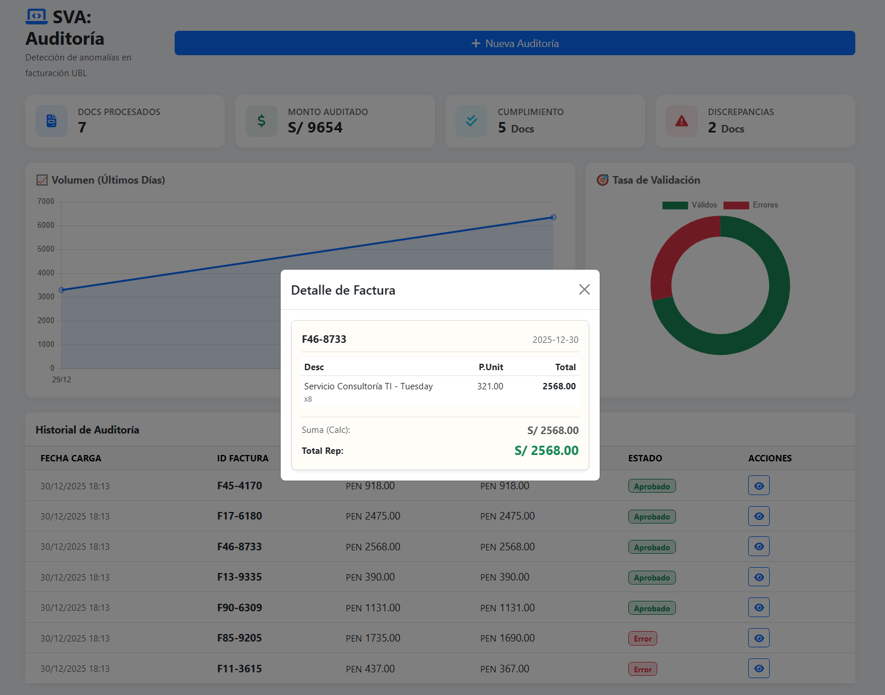

# 🛡️ SVA: Sistema de Validación y Auditoría

**Detección automatizada de anomalías matemáticas en facturación electrónica UBL.**

El **SVA (Sistema de Validación y Auditoría)** es una solución tecnológica diseñada para procesar archivos XML de comprobantes electrónicos. Su motor realiza un recálculo aritmético línea por línea de cada factura para verificar la integridad de los montos declarados, identificando discrepancias, errores de redondeo o inconsistencias tributarias en tiempo real.


---

## 🚀 Flujo de Trabajo y Características Visuales

El sistema permite una auditoría exhaustiva a través de un proceso de carga, previsualización y análisis detallado.

### 1. Panel de Control (Dashboard)
El centro de operaciones ofrece una visión inmediata del estado del cumplimiento tributario.
* **KPIs en tiempo real:** Volumen procesado, monto total auditado, y conteo de documentos válidos vs. discrepantes.
* **Tendencia Gráfica:** Visualización del volumen transaccional diario (basado en la fecha real de emisión del documento).
* **Tasa de Validación:** Gráfico de dona mostrando el porcentaje de cumplimiento.
* **Historial de Auditoría:** Tabla resumen con acceso rápido al detalle de cada documento.

### 2. Módulo de Carga Inteligente
El sistema ofrece dos métodos de ingesta de datos, diseñados para distintos escenarios de auditoría.

#### Carga Manual desde PC
Permite seleccionar uno o múltiples archivos XML desde el equipo local para un procesamiento en lote inmediato.


#### Repositorio y Previsualización
Permite auditar archivos ya existentes en el servidor (útil para pruebas o cargas programadas). Incluye una potente función de **Vista Previa Activa** que analiza el XML antes de procesarlo.

* **Vista Previa de Documento Válido:** El sistema confirma que los cálculos internos coinciden con el total reportado en el XML. El botón de procesamiento se habilita en verde.


* **Detección Temprana de Errores:** Si el XML contiene inconsistencias (el total declarado no coincide con la suma de los ítems), el sistema alerta visualmente resaltando los montos erróneos en rojo incluso antes de guardar la data.


### 3. Análisis Detallado de Resultados
Una vez procesados, los documentos se pueden inspeccionar en detalle para auditoría forense.

* **Detalle de Factura Conforme:** Muestra el desglose de ítems, precios unitarios y confirma que el *Total Calculado* (Suma Calc) coincide con el *Total Reportado* (Total Rep).


* **Evidencia de Discrepancia:** En caso de error, el detalle muestra explícitamente la diferencia entre la realidad matemática y lo declarado en el documento, marcando el hallazgo con una alerta visual para facilitar la corrección.


---

## 🛠️ Stack Tecnológico

* **Backend:** Python 3, Django Framework.
* **Procesamiento XML:** Librería nativa `xml.etree.ElementTree` para parsing eficiente de estructuras UBL.
* **Base de Datos:** SQLite (fácilmente escalable a PostgreSQL/MySQL).
* **Frontend:** HTML5, CSS3, Bootstrap 5 para interfaz responsiva.
* **Visualización:** Chart.js para gráficos interactivos.

## ⚙️ Instalación y Configuración Local

1.  **Clonar el repositorio**
    ```bash
    git clone [https://github.com/DivorcedLance/invoice_audit](https://github.com/DivorcedLance/invoice_audit)
    cd invoice_audit
    ```

2.  **Configurar entorno virtual**
    ```bash
    python -m venv venv
    # Activar en Windows:
    venv\Scripts\activate
    # Activar en macOS/Linux:
    source venv/bin/activate
    ```

3.  **Instalar dependencias**
    ```bash
    pip install django
    ```

4.  **Inicializar la base de datos**
    ```bash
    python manage.py makemigrations
    python manage.py migrate
    ```

5.  **Ejecutar el servidor de desarrollo**
    ```bash
    python manage.py runserver
    ```
    Acceder a `http://127.0.0.1:8000`.

## 🧪 Generación de Datos de Prueba

El proyecto incluye un generador de facturas sintéticas para simular escenarios de auditoría.

1.  Ejecutar el script generador:
    ```bash
    python generate_data.py
    ```
    *Este script poblará la carpeta `sample_xmls/` con facturas válidas y erróneas, con fechas distribuidas en la semana actual.*

2.  En el aplicativo, ir a **Nueva Auditoría > Usar Repositorio** y utilizar el botón **"Procesar Todo"** para cargar el lote completo.

---
**SVA: Sistema de Validación y Auditoría** - Herramienta desarrollada para garantizar la integridad financiera y tributaria.